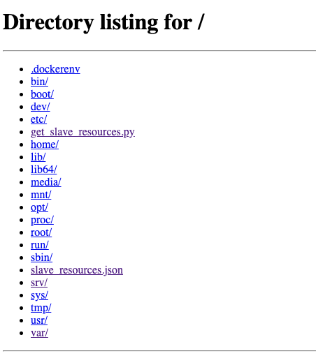
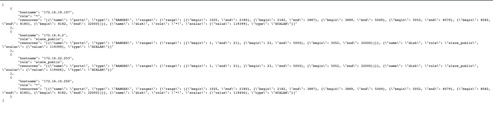

# Get DC/OS Agent Resources
Uses Python requests and `http.server` to obtain resource information from each of your DC/OS Agents. This container will simply run a python script that obtains the information and outputs it to a file called "`slave_resources.json`" that can be viewed and downloaded via browser.


### Building
```bash
docker build -t slave-resources .
```

### Running 
```bash 
docker run -d -p 8000:8000 slave-resources
```

Go to your browser to `http://master_public_ip:8000` and open `slave_resources.json`.

Example output:



